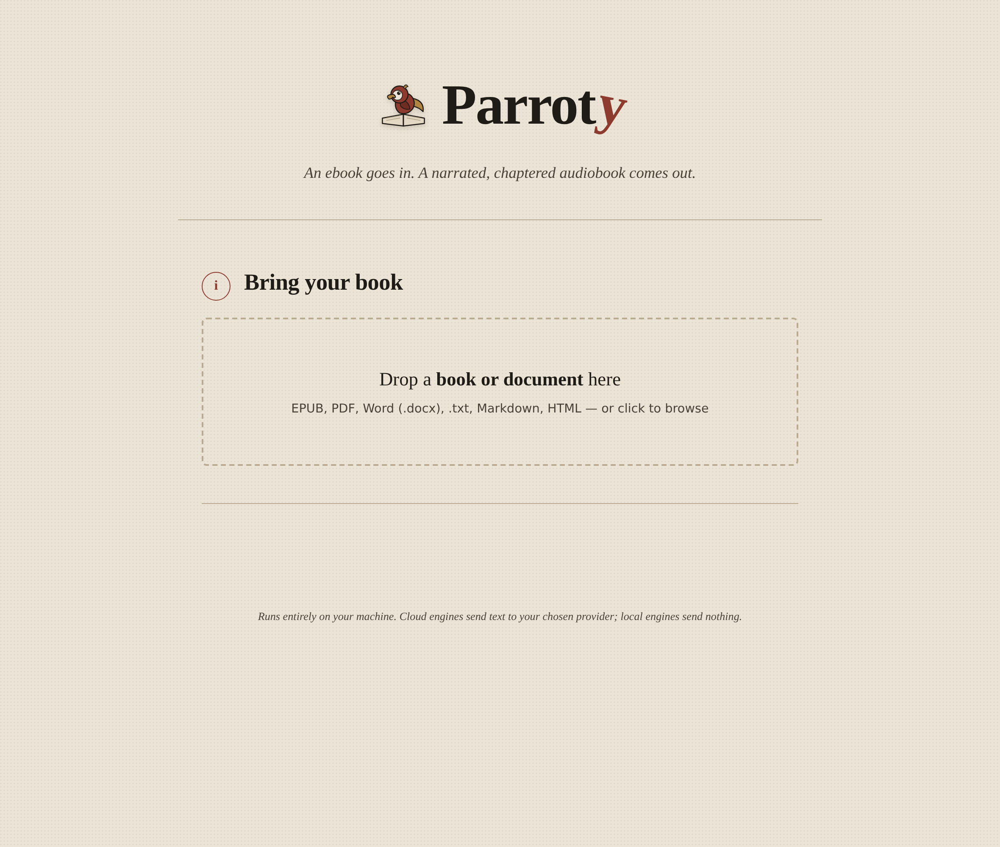
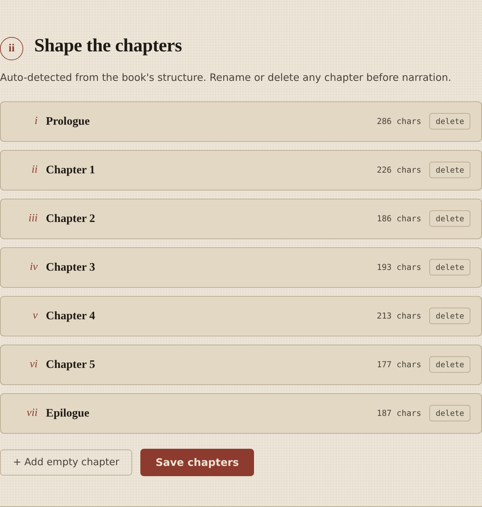
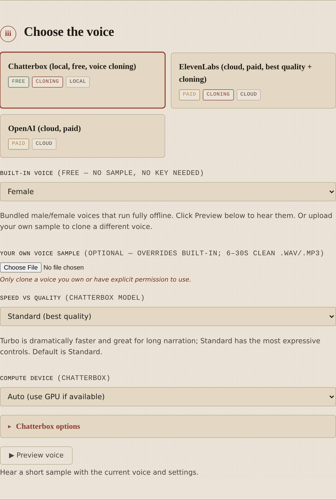
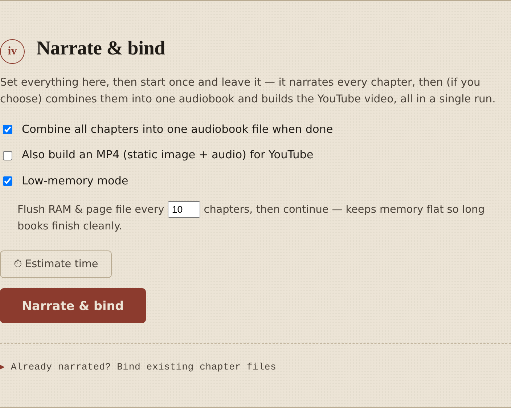
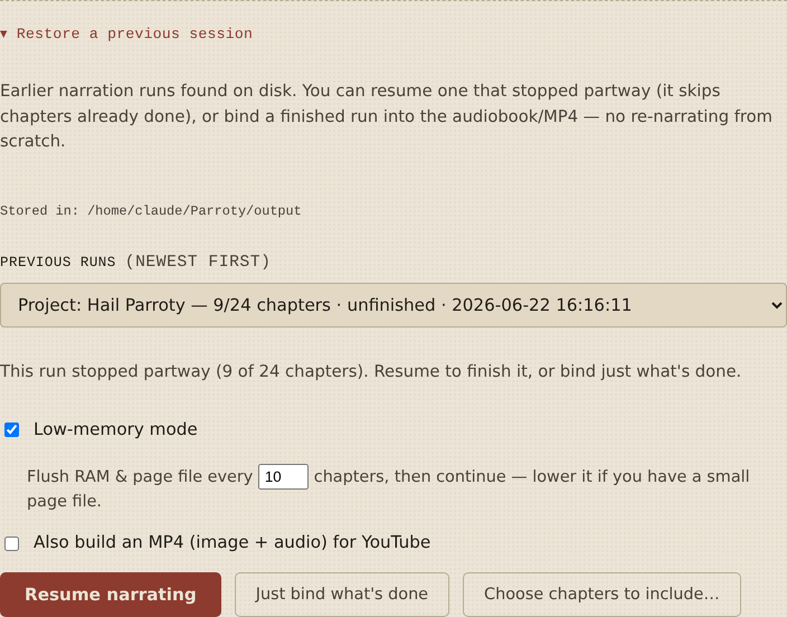

# Parroty — Book/Document → Audiobook

A local Python web app that turns a book or document (EPUB, PDF, Word, TXT,
Markdown, HTML) into a narrated
audiobook: one audio file per chapter, then optionally combined into a single
audiobook plus an MP4 (static image + audio) with YouTube-ready chapter
timestamps. Everything runs on your own machine and opens in Chrome.

## Table of Contents

- [Highlights](#highlights)
- [Known issues](#known-issues)
- [Screenshots](#screenshots)
- [What it does](#what-it-does)
- [Voice engines](#voice-engines)
- [Requirements & disk space](#requirements--disk-space)
- [Install and run](#install-and-run)
- [Setup from scratch (Python only)](#setup-from-scratch-python-only)
- [Running and stopping](#running-and-stopping)
- [Updating to a new version](#updating-to-a-new-version)
- [Run it overnight (narrate + bind in one pass)](#run-it-overnight-narrate--bind-in-one-pass)
- [Keeping the GPU at full speed](#keeping-the-gpu-at-full-speed)
- [Memory use on 16 GB machines](#memory-use-on-16-gb-machines)
- [How YouTube chapters work](#how-youtube-chapters-work)
- [Playing from Google Drive (with chapters)](#playing-from-google-drive-with-chapters)
- [Project layout](#project-layout)
- [Troubleshooting](#troubleshooting)
- [Notes](#notes)
- [Tech stack](#tech-stack)
- [License](#license)

## Highlights

- **Any common book/document format in:** EPUB, PDF, Word (.docx), TXT, Markdown,
  HTML — chapters auto-detected from the book's real structure, with reading
  order preserved.
- **Three voice engines:** OpenAI and ElevenLabs (cloud, paid) and **Chatterbox**
  (free, local, GPU-accelerated) which can clone a voice from a ~10-second sample.
- **One file per chapter,** then optionally combined into a single audiobook and
  an **MP4** (cover image + audio) for YouTube.
- **YouTube chapter markers generated for you** — a ready-to-paste timestamp list
  so YouTube auto-creates chapter jumps in your video.
- **Clickable chapters for Google Drive too** — for books too long for YouTube,
  Parroty builds a small page that turns each chapter into a link that opens the
  Drive video at that point (chapter marks are also embedded in the MP4 for VLC).
- **Edit chapters before narrating** — rename, delete, or add chapters, and
  drop chapters to fit YouTube's 12-hour limit.
- **Built for long books on modest hardware:** a true low-memory mode that
  recycles the narration process every *N* chapters to keep RAM flat, a live
  free-RAM readout, and a rock-solid Resume that picks up exactly where it left
  off — finishing 100+ chapter books on a 16 GB machine without crashes.
- **Runs entirely on your own machine** — your files and (for the local engine)
  your audio never leave your computer.

## Known issues

**GPU can throttle when Parroty isn't in the foreground.** When the Parroty
console window loses focus or is minimized, Windows can throttle the process and
GPU utilization drops sharply — sometimes to around 10%. Parroty already opts
itself **and its narration workers** out of Windows' background power throttling
(EcoQoS), raises priority, and keeps the system awake, which fixes this on most
machines — but on some laptops it isn't always enough on its own.

**Recommended workaround — run with no window at all:** start Parroty with
**`run_hidden.bat`** instead of `run.bat`. It launches the server with
`pythonw.exe`, so there's no console window to lose focus in the first place — the
browser keeps focus and the GPU stays at full speed. Chrome still opens at
http://127.0.0.1:5000 and all output is saved to `parroty.log`. Stop it with
`stop.bat` (or end `pythonw.exe` in Task Manager).

If you prefer the visible console (`run.bat`), keep that window unminimized while
narrating, and on a laptop plug in AC power and apply the settings under
[Keeping the GPU at full speed](#keeping-the-gpu-at-full-speed) below.

## Screenshots

<p align="center">
  
</p>

Chapters are auto-detected from the book's structure, and you can rename or
delete any of them before narrating:



Pick a voice engine — including **Chatterbox**, which runs locally for free and
can clone a voice from a short sample:



Set it once and leave it: narrate, combine, and build the YouTube MP4 in a single
run, with **low-memory mode** keeping RAM flat on long books:



Stopped partway? **Resume** continues from exactly where it left off — with an
adjustable memory-flush interval for machines with a small page file:



> Prefer one tall image of the whole page? See
> [`docs/screenshots/00-overview-full.png`](docs/screenshots/00-overview-full.png).

## What it does

1. **Upload** a book or document — EPUB, PDF, Word (.docx), .txt, Markdown,
   or HTML. Chapters are auto-detected (from the book's structure, document
   headings, or heading-like lines in plain text). You can edit them after.
2. **Edit chapters** — rename, delete, or add any chapter by hand.
3. **Pick a voice engine** and a voice (or upload a sample to clone).
4. **Narrate** — produces one audio file per chapter.
5. **Bind** — combine all chapters into one audiobook, optionally with a cover
   image as an MP4, plus a `youtube_chapters.txt` you can paste into a video
   description so YouTube auto-creates chapter markers, and a **subtitles
   `.srt`** with timing taken straight from the narration (see below).

**Subtitles (`.srt`):** binding also writes a `subtitles-…srt` file. As each
chapter is narrated, Parroty records the exact start/end of every spoken chunk
from the generated audio, so the subtitle timing matches the MP3 precisely (not
estimated) and the text is the book's own words. Download it from the bind
results. It drops straight into SeeStory, which can burn it into the video or
add it as a toggleable track. Subtitles are produced for the local Chatterbox
voice; cloud engines that synthesize a whole chapter at once don't expose
per-chunk timing, so those chapters are skipped.

## Voice engines

| Engine | Cost | Cloning | Notes |
|--------|------|---------|-------|
| **OpenAI** | paid (cloud) | no | 6 built-in voices, easiest, very good quality |
| **ElevenLabs** | paid (cloud) | yes | best naturalness, clones from a sample |
| **Chatterbox** | free (local) | yes | clones from ~10s sample, GPU recommended |

Cloud engines need an API key, entered in the UI — it's sent only to that
provider, never stored. You pay the provider directly on your own account.

WARNING: Only clone voices you own or have explicit permission to use.

---

## Requirements & disk space

> **FYI — read before installing.** The local voice engine pulls down PyTorch and
> a TTS model, so it needs some room and (ideally) a CUDA GPU. The cloud voices
> (OpenAI / ElevenLabs) need almost no disk and no GPU.

**Tested on:** Windows 11, **NVIDIA RTX 5060 Laptop GPU (8 GB VRAM)**,
PyTorch + CUDA 12.8, Python 3.12. It's a solo‑developer project built and run on
that exact setup — other configurations should work but haven't been exercised.

| Need | Detail |
|------|--------|
| OS | Windows 10/11 for the `.bat` launchers; macOS/Linux work from the command line |
| GPU | Only for the local **Chatterbox** engine: NVIDIA with CUDA (the **CUDA 12.8** build for RTX 50‑series). **8 GB VRAM is plenty** for TTS. CPU‑only works but is much slower; Apple Silicon (Metal) also accelerates Chatterbox. Cloud voices need no GPU. |
| ffmpeg | Required — combines the per‑chapter audio and builds the MP4 |
| Python | 3.10+ (3.12 recommended) |
| Accounts (optional) | An OpenAI or ElevenLabs API key only if you use those cloud voices |

**Disk space — budget ~10–15 GB free** (only if you use the local engine):

| Item | Approx. size | When |
|------|-------------|------|
| Python venv (PyTorch CUDA + dependencies) | ~5–8 GB | at setup |
| Chatterbox voice model | a few GB | first time you narrate locally |
| Your generated audio (per‑chapter MP3s + combined audiobook + MP4) | varies — a long book can be 1–3 GB | as you narrate |

The Chatterbox model is downloaded once and cached in your Hugging Face cache
(`%USERPROFILE%\.cache\huggingface`). If you only use the cloud voices, you can
skip the local engine entirely and the footprint is tiny.

## Install and run

Make sure **Python 3.12** and **ffmpeg** are installed first (see steps 1–2
below if you haven't — these are one-time, machine-wide installs).

### Setup (paste this into PowerShell)

Open PowerShell **inside the Parroty folder** and paste this whole block in
one go. It creates the environment, installs everything (core packages + PyTorch
+ Chatterbox), and starts the app:

```powershell
py -3.12 -m venv venv
.\venv\Scripts\Activate.ps1
pip install -r requirements.txt
pip install chatterbox-tts
pip install --force-reinstall torch torchaudio --index-url https://download.pytorch.org/whl/cu128
python -m app.server
```

Chrome opens automatically at `http://127.0.0.1:5000`. Press **Ctrl+C** to stop.

> **Prefer to double-click instead of typing commands?** See
> **`Quick Start Readme.txt`** in this folder. It walks you through creating a
> few optional Windows launcher files — including an `install_all.bat` that
> installs *everything* (Python, ffmpeg, the environment, all packages, and GPU
> PyTorch) in one double-click, and a `run.bat` to start Parroty. They're
> optional; the commands above do the same job.

> **First-run PowerShell note.** If the `.\venv\Scripts\Activate.ps1` line gives
> *"running scripts is disabled on this system"*, run this **once** (per machine),
> answer **Y**, then retry:
> ```powershell
> Set-ExecutionPolicy -Scope CurrentUser RemoteSigned
> ```
> This is a standard, safe setting that only affects your user account (no admin
> needed). Alternatively, skip activation entirely and run the app directly —
> this never hits the policy block:
> ```powershell
> venv\Scripts\python.exe -m app.server
> ```

> The `cu128` line installs the **GPU (CUDA 12.8)** build of PyTorch — needed for
> NVIDIA GPUs including the new RTX 50-series. Install it **last** with
> `--force-reinstall` so another package's dependency can't replace it with the
> slow CPU build. It still works on machines without an NVIDIA GPU (just runs on
> CPU). If that line fails, use the plain CPU build: `pip install torch torchaudio`.

**Next time** you just need the last two lines (the installs are already done):

```powershell
.\venv\Scripts\Activate.ps1
python -m app.server
```

> The manual step-by-step instructions below explain each line, in case you want
> the detail or aren't on Windows.

---

## Setup from scratch (Python only)

### 1. Install Python 3.10+

Check whether you already have it:

```bash
python3 --version
```

If it prints 3.10 or higher you're set. Otherwise download it from
<https://www.python.org/downloads/> (on Windows, tick **"Add Python to PATH"**
during install).

### 2. Install ffmpeg

ffmpeg does the audio combining and MP4 video export.

- **Windows** (easiest): run `winget install ffmpeg` in PowerShell, then close
  and reopen PowerShell and verify with `ffmpeg -version`. (winget handles the
  download and PATH setup for you.)
- **macOS** (with Homebrew): `brew install ffmpeg`
- **Ubuntu / Debian**: `sudo apt install ffmpeg`

> Note: ffmpeg has no traditional installer — it's just an executable that needs
> to be on your PATH. On Windows, `winget install ffmpeg` is the simplest route.
> If you'd rather do it by hand, download the **release-essentials** build from
> <https://www.gyan.dev/ffmpeg/builds/>, unzip it (e.g. to `C:\ffmpeg`), and add
> the `C:\ffmpeg\bin` folder to your PATH.

### 3. Get the project folder

Put the `Parroty` folder wherever you like, then open a terminal **inside**
it (so you're in the same directory as `requirements.txt`):

```bash
cd path/to/Parroty
```

### 4. Create a virtual environment (recommended)

This keeps Parroty's dependencies isolated from the rest of your system.

```bash
# macOS / Linux
python3 -m venv venv
source venv/bin/activate

# Windows (PowerShell) — use py -3.12 to force Python 3.12
py -3.12 -m venv venv
.\venv\Scripts\Activate.ps1
```

> On Windows, type `py -3.12` (instead of `python`) to force Python 3.12, which
> is the most compatible version for the audio/TTS libraries. If you have
> multiple Python versions installed, this picks the right one. Once the venv is
> active and your prompt shows `(venv)`, plain `python` and `pip` use 3.12
> automatically.

You'll know it worked when your prompt shows `(venv)` at the start.

### 5. Install the Python dependencies

```bash
pip install -r requirements.txt
```

This installs the core app (Flask, EPUB parsing, audio handling) plus the
cloud TTS clients (OpenAI, ElevenLabs).

### 6. (Optional) Install the local cloning engine — Chatterbox

Only needed if you want **Chatterbox** (free, local, voice cloning). Chatterbox
needs **PyTorch**, which has a platform-specific install, so it's two steps in
this order:

```bash
# 1) PyTorch first — GPU (CUDA 12.8) build, needed for NVIDIA GPUs
#    incl. the new RTX 50-series. Works on CPU-only machines too.
pip install torch torchaudio --index-url https://download.pytorch.org/whl/cu128

# 2) then Chatterbox
pip install chatterbox-tts
```

> If you skip the PyTorch step you'll get **"No module named 'torch'"** when you
> click Narrate. The `cu128` line above installs the GPU build. If you have **no
> NVIDIA GPU** and want a smaller download, use the plain CPU build instead:
> `pip install torch torchaudio`. For the absolute latest GPU build (or if cu128
> fails on a very new card), see <https://pytorch.org/get-started/locally/>.

A GPU makes this much faster, but it runs on CPU too (slowly). You can skip this
step entirely and just use OpenAI or ElevenLabs.

**Chatterbox voices.** Chatterbox always narrates from a reference clip. In the
app you can either:
- pick a **built-in voice** — bundled American or British, male or female
  (American is the default). These run fully offline with **no API key**; or
- **upload your own sample** (6–30s clean `.wav`/`.mp3`) to clone any voice.

Either way, click **Preview voice** to hear a short sample with your current
voice and settings before narrating the whole book. A collapsible **Chatterbox
options** panel lets you tune exaggeration, CFG/pace, and temperature (defaults
are shown on each slider, with a **Reset to defaults** button).

**Speed vs quality (Standard vs Turbo).** A "Speed vs quality" selector picks the
Chatterbox model:
- **Standard** (default) — the original model, most expressive controls, best
  quality, but slower.
- **Turbo** — a streamlined model distilled to generate in far fewer steps, so
  it's **dramatically faster** and purpose-built for long narration. It ignores
  the exaggeration/CFG sliders. If Turbo isn't available, update with
  `pip install -U chatterbox-tts`.

**Estimate time.** Before committing to a long book, click **⏱ Estimate time**.
It renders one short calibration clip on your actual hardware (with your chosen
model and device), measures the speed, and projects the total. Because it
measures *your* machine, the estimate reflects your real GPU/CPU — not a generic
guess. It's an estimate, so actual time varies somewhat by chapter.

> **About speed.** Chatterbox is a neural model. On CPU it's very slow (hours per
> book). A GPU helps enormously, and **Turbo** is the biggest single speedup.
> Even so, a full book on a laptop GPU is realistically tens of minutes to a
> couple of hours depending on the model and length. If you need a book done in
> minutes, the cloud engines (OpenAI/ElevenLabs) are far faster (but paid).

**Compute device (GPU vs CPU).** Under the Chatterbox settings there's a
**Compute device** selector:
- **Auto** — uses a GPU if one is available, otherwise CPU (recommended).
- **NVIDIA GPU (CUDA)** — appears only if you have an NVIDIA card with a
  CUDA-enabled PyTorch build. **Strongly preferred — many times faster.**
- **Apple GPU (Metal)** — appears on Apple Silicon Macs.
- **CPU only** — works everywhere but is **extremely slow** (often several
  minutes per few seconds of audio; a full book can take hours).

⚡ **A GPU is strongly preferred.** To use an NVIDIA GPU you must install the
CUDA build of PyTorch — get the exact command for your system at
<https://pytorch.org/get-started/locally/> (instead of the plain `pip install
torch torchaudio` CPU line). Note: **integrated Intel/AMD graphics cannot be
used** by PyTorch for this and will fall back to CPU — only discrete NVIDIA
(CUDA) or Apple Silicon (Metal) GPUs accelerate Chatterbox.

**If you have an NVIDIA GPU but it's still using CPU:** the plain `pip install
torch torchaudio` installs a **CPU-only** build, and older CUDA builds (cu124 and
earlier) don't support the new RTX 50-series. Parroty shows a warning under the
Compute device selector when this happens.

**The fix:** in your activated venv, force-reinstall the CUDA GPU build:

```powershell
pip install --force-reinstall --no-cache-dir torch torchaudio --index-url https://download.pytorch.org/whl/cu128
```

(This is also why the setup installs PyTorch *last* and force-reinstalls it — so
the GPU build can't be replaced by a CPU build pulled in as another package's
dependency.)

For a **very new GPU (e.g. RTX 50-series / Blackwell)**, CUDA 12.8 (`cu128`) is
what you need. If it still falls back to CPU, try the nightly build:

```powershell
pip install --pre --force-reinstall torch torchaudio --index-url https://download.pytorch.org/whl/nightly/cu128
```

The authoritative, always-current command is at
<https://pytorch.org/get-started/locally/> (select Pip / Windows / CUDA 12.8).
After reinstalling, restart Parroty; the Compute device selector should then list
your GPU and the warning turns into a green "GPU is available" note.

> Quick check: run `python -c "import torch; print(torch.cuda.is_available())"`
> in your venv to see whether PyTorch can use your GPU.

---

## Running and stopping

**From the command line** (with your venv active), from inside the `Parroty`
folder:

```bash
python -m app.server
```

It starts a local server and **automatically opens Chrome** to
`http://127.0.0.1:5000` (falling back to your default browser if Chrome isn't
installed). Press **Ctrl+C** to stop.

**Hidden (no window):** double-click **`run_hidden.bat`** to start Parroty with no
console window at all (it runs under `pythonw.exe`). Chrome still opens
automatically and output goes to `parroty.log`; stop it with `stop.bat`. This
sidesteps the foreground/throttling note in [Known issues](#known-issues). Run it
**after** `setup.bat` — it's an alternative to `run.bat`, not a replacement for
setup.

Starting again later needs no reinstall — setup is one-time. Open a terminal,
`cd` into the Parroty folder, activate the venv, and run the server:

```bash
# Windows (PowerShell)
.\venv\Scripts\Activate.ps1
python -m app.server

# macOS / Linux
source venv/bin/activate
python -m app.server
```

> Tip: to skip the auto-open browser, set `PARROTY_NO_BROWSER=1` before running.

---

## Updating to a new version

Your installed packages live inside the `venv` folder, which sits **inside** the
Parroty folder. So:

- If you **delete the whole folder** and re-download, you also delete the venv —
  run the install steps once more.
- If you only want the new code and want to **keep your installed packages**,
  copy the new `app` folder and `requirements.txt` over your existing folder,
  leaving `venv` untouched. No reinstall needed.

You only ever need to reinstall packages when `requirements.txt` changes (a new
dependency was added). Re-running the install is always safe — pip reuses the
existing venv and only installs what's missing.

---

## Run it overnight (narrate + bind in one pass)

In the **Narrate & bind** step you set everything *before* starting, then click
once and walk away:

- **Combine all chapters into one audiobook** (checked by default).
- **Also build an MP4** (static cover image + audio) for YouTube — tick this and
  upload a cover image.

When you click **Narrate & bind**, Parroty narrates every chapter, then combines
them, then builds the video — all in a single run, with one progress bar
covering the whole job. Leave it overnight; it's done by morning. The
**⏱ Estimate time** button accounts for the bind/video steps too.

Binding itself is fast relative to narration: combining is quick, and the MP4
encode is typically a few minutes even for a long book. The slow part is always
the narration.

Each run is saved in its own folder under `output/`, named after the book and
the date (e.g. `the-great-gatsby_2026-06-18_2109_xxxx`). If a run finished but
binding failed or was skipped — even in a previous session — open **"Already
narrated? Bind existing chapter files"** in the Narrate step, pick the run from
the list (shown by book title and date), and bind it without re-narrating.

Cover images can be any common format — JPG, PNG, WebP, even AVIF — Parroty
converts them automatically so ffmpeg can read them.

## Keeping the GPU at full speed

If you've seen the GPU drop to ~10% the moment the Parroty console loses focus,
and jump back to full speed when you click it: that's Windows applying *power
throttling* (EcoQoS) to background processes. Parroty opts itself **and its
narration workers** out of that throttling, raises its priority, and keeps the
system awake.

**Important:** as noted in [Known issues](#known-issues) above, this isn't
always enough — on some machines (especially laptops) the GPU still slows when
the window loses focus, so for now **keep the Parroty console window in the
foreground while narrating**.

On a **laptop** the GPU is throttled even harder by power policy, so for maximum
speed also:

- **Plug in AC power.** On battery, Windows and the GPU throttle aggressively no
  matter what; this is the single biggest factor on a laptop.
- **Windows Settings → System → Power → Power mode → "Best performance."**
- **NVIDIA Control Panel → Manage 3D settings → Power management mode → "Prefer
  maximum performance"** (set it globally, or just for `python.exe`). This stops
  the GPU from down-clocking when it thinks it's idle.

With AC power, those performance settings, and the Parroty window kept in the
foreground, the GPU should stay pinned.

## Memory use on 16 GB machines

**If you see "The paging file is too small for this operation" (os error 1455):**
this means Windows' page file (virtual memory) is capped too low. Let Windows
manage it automatically:

1. Press **Win + R**, type `sysdm.cpl`, Enter.
2. **Advanced** tab → Performance **Settings** → **Advanced** tab → Virtual
   memory **Change**.
3. Tick **"Automatically manage paging file size for all drives"**.
4. OK, then **restart the PC**.

This is the most common cause of a crash partway through a long book on a 16 GB
machine, and the one-time setting above fixes it for good.

Chatterbox is a large model and keeps itself loaded in RAM while running, so a
long book can press against a 16 GB machine. Parroty has several safeguards:

- **Low-memory mode** (checkbox in the Narrate step *and* on the Resume screen,
  on by default) narrates in batches and, after every *N* chapters, fully shuts
  down and restarts the narration process. When a process exits, Windows hands
  back **all** of its RAM and page-file memory unconditionally — so memory
  sawtooths back to baseline on every restart and stays flat for the whole book,
  no matter how long it is. Parroty then resumes automatically from the exact
  chapter it left on. This is the most reliable way to finish a long book on a
  RAM-limited machine without "out of memory" or "bad allocation" errors.
- **Custom flush interval:** the number next to the checkbox ("Flush RAM & page
  file every *N* chapters") is yours to set — 1 to 500. Lower it (5, or even 1)
  if you have a small page file or hit memory errors; raise it for fewer
  restarts if you have RAM to spare. The time estimate accounts for the restart
  overhead.
- **Live memory readout:** the progress bar shows free RAM in real time (e.g.
  `45% · ch 27/107 · RAM 3.6 GB free`), and Parroty does a lighter cache reclaim
  on the spot if RAM dips low mid-chapter, so you can always see what memory is
  doing.
- **Reliable resume:** each chapter is written to disk as it finishes and tagged
  by a stable identity derived from its text — not by its position in the list.
  So if a run stops, crashes, or you close it, just reopen and click **Resume**:
  Parroty recognizes exactly which chapters are already done (even if you've
  since reordered, renamed, or deleted others) and continues with only what's
  left — never redoing finished work and never producing duplicates.
- **Stops safely, never half-breaks:** if a chapter ever fails (e.g. a genuine
  out-of-memory), Parroty saves everything finished so far and halts with a
  clear "free some RAM, then Resume" message, rather than corrupting the run.
- **Tips:** close other memory-heavy apps (especially Chrome) before a long run,
  and prefer the **Turbo** model, which is lighter as well as faster.

## How YouTube chapters work

YouTube builds chapter markers from **timestamps in the video description**,
not from the file. After binding, copy the generated timestamps (the app gives
you a button) into your description. They look like:

```
00:00 Chapter One: Departure
04:12 Chapter Two: The Storm
09:48 Chapter Three: Landfall
```

YouTube requires the first stamp to be `00:00` and at least 3 chapters. The MP4
also has chapter markers embedded directly (visible in players like VLC).

---

## Playing from Google Drive (with chapters)

When a book is too long for YouTube (over 12 hours), you can play the MP4
straight from Google Drive instead. Drive's player has no chapter menu, but its
video links accept a start time, so after binding Parroty also gives you a
**clickable chapter index**: a `drive-chapters-…html` file alongside the
audiobook.

To use it:

1. Upload the MP4 to Google Drive and let it finish processing.
2. Right-click it → **Share** → **Copy link**.
3. Double-click the `drive-chapters-…html` file (it opens in your browser) and
   paste that link into the box.

Every chapter becomes a link that opens the Drive video at that point. The page
is self-contained — keep it next to your audiobook and reuse it anytime; it needs
no internet to build the links.

For an actual in-player chapter menu instead of links, the MP4 has the chapter
marks embedded directly, so downloading it and opening in **VLC** (or another
desktop player) gives a real chapter list to jump around.

---

## Project layout

```
Parroty/
  app/
    server.py            Flask app + all routes, auto-opens Chrome
    epub_parser.py       EPUB -> chapters, manual re-splitting
    tts.py               engine registry + catalog
    assembler.py         combine audio, timestamps, build MP4
    converters/
      openai_engine.py
      elevenlabs_engine.py
      chatterbox_engine.py
    templates/index.html
    static/style.css, app.js
  requirements.txt
  uploads/   output/      (created automatically at runtime)
```

## Troubleshooting

- **`python` not found** — try `python3` instead (and `pip3`).
- **"ffmpeg not found"** in the app — ffmpeg isn't on your PATH. On Windows run
  `winget install ffmpeg`, then restart PowerShell (redo step 2). Audio
  narration still works without it, but combining and MP4 export won't.
- **PowerShell won't activate the venv** —
  - If you see *"The module 'venv' could not be loaded"*, you left off the `.\`
    prefix. Run it as `.\venv\Scripts\Activate.ps1` (the `.\` tells PowerShell
    it's a file path, not a command).
  - If you see *"running scripts is disabled on this system"*, run
    `Set-ExecutionPolicy -Scope CurrentUser RemoteSigned` once, then retry.
- **"No module named 'torch'" or "No module named 'chatterbox'"** when you click
  Narrate or Preview — these packages aren't installed in the venv that's running
  Parroty. Activate your venv, run `pip install chatterbox-tts`, then
  `pip install --force-reinstall torch torchaudio --index-url
  https://download.pytorch.org/whl/cu128` (torch last so it isn't replaced by a
  CPU build). Confirm with `python -c "import chatterbox, torch"` before retrying.
- **Built-in voices need no key** — the bundled male/female voices run fully
  offline. If you want to preview or use them, just pick one and click Preview.
- **Port 5000 already in use** — change the port at the bottom of
  `app/server.py` (`port=5000`) to e.g. `5001`.

## Notes

- `.mobi` is not supported — convert to `.epub` first with Calibre if needed.
- Projects live in memory; restarting the server clears them.
- **Preview and Narrate show a live progress bar with a running ETA**, so you
  can see it's working and roughly how long is left.
- **Speed on CPU:** Chatterbox is a neural model. On a GPU it's near real-time;
  on **CPU only it's much slower — often several minutes for a few seconds of
  audio**, and a full book can take hours. This is normal and not a bug. Tips:
  use **Preview** to dial in the voice on a short sample before committing, then
  run **Narrate** when you can leave it going. If you need speed, the cloud
  engines (OpenAI/ElevenLabs) are near-instant but paid.

## Tech stack

- **Language:** Python 3.12 + vanilla JavaScript/HTML/CSS
- **Backend:** Flask (+ Werkzeug dev server), Server-Sent Events for progress
- **Frontend:** No framework — plain JS, `fetch()`, SSE
- **TTS engines:** Chatterbox (local, ResembleAI), OpenAI, ElevenLabs
- **ML/GPU:** PyTorch with CUDA 12.8 (cu128) on NVIDIA
- **Document parsing:** ebooklib (EPUB), pdfplumber (PDF), python-docx (Word), custom parsers (txt/Markdown/HTML/RTF)
- **Audio:** pydub, ffmpeg, Pillow (+pillow-avif-plugin), stdlib `wave`
- **System:** psutil (memory monitoring), ctypes (Windows API), batch-file launchers
- **Architecture:** Local single-user web app on `127.0.0.1:5000`, state on disk under `output/`

## License

Released under the **MIT License** — free to use, modify, and distribute,
including commercially. See [LICENSE](LICENSE). (Replace `[YOUR NAME]` in that
file with your name.) The third-party voice engines and libraries Parroty builds
on keep their own licenses.

> Only clone or synthesize voices you own or have explicit permission to use.
